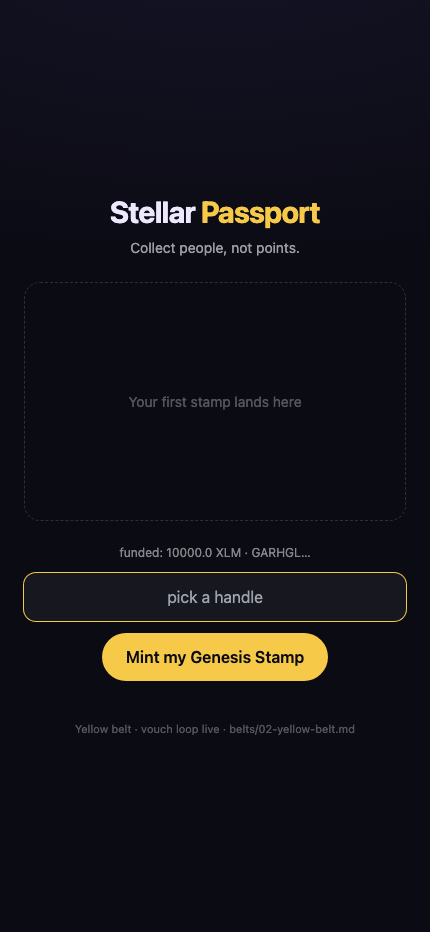
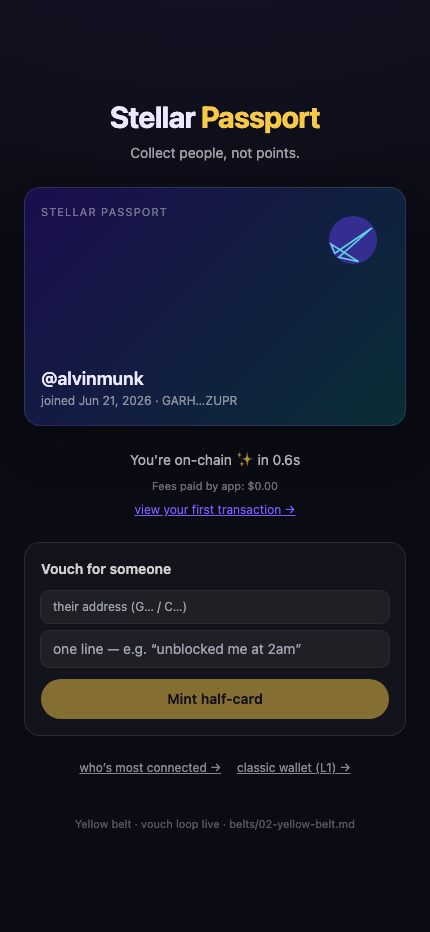
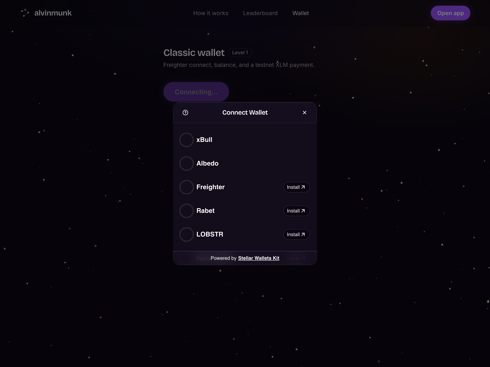
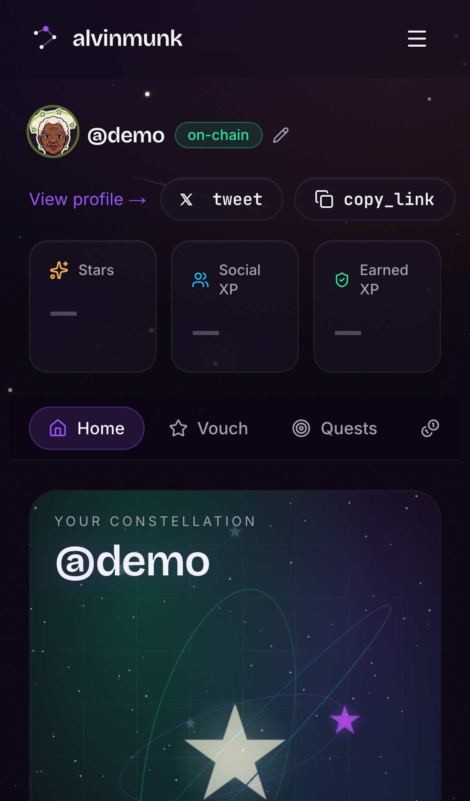
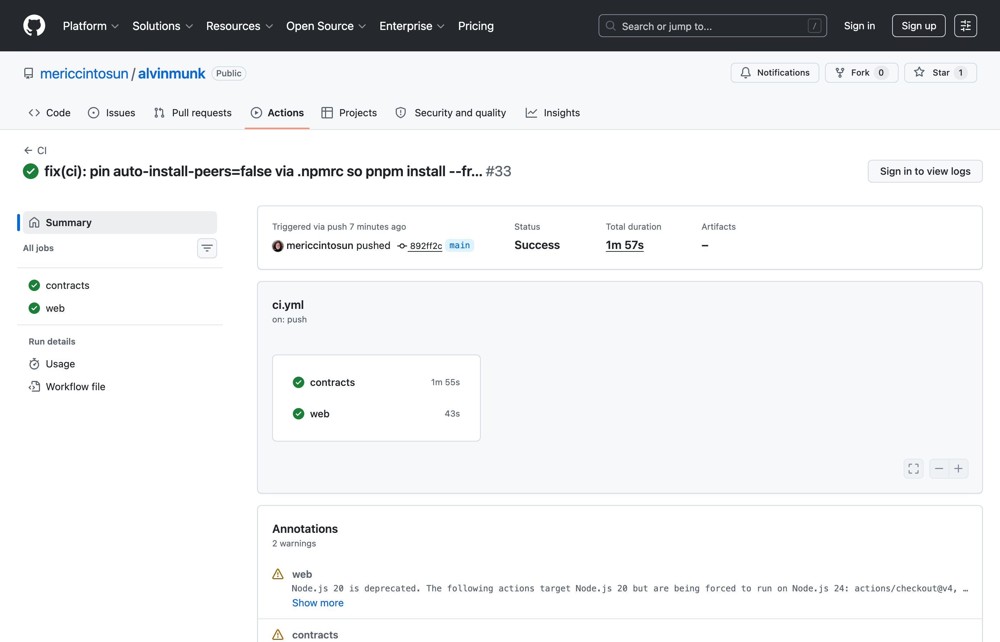
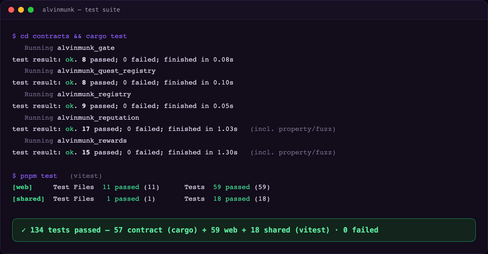

# 🛰️ alvinmunk

> **Collect people, not points.** A social, gamified, non-betting *proof-of-people* reputation game on Stellar/Soroban — built for the Rise In **Stellar Journey to Mastery** belt program (White → Master).

**▶ Live on Stellar testnet: [alvinmunk.vercel.app](https://alvinmunk.vercel.app)**

You earn reputation through **mutual/social actions** (vouch for someone, complete a verifiable quest, tip), not solo grinding. Badges name **other humans** and auto-generate a shareable card — reputation about *others* is viral; reputation about *yourself* is a résumé. Reputation is **spendable**: it unlocks bounties, ranking, and USDC micro-rewards.

The full product thesis, the persona debates, and the belt-by-belt roadmap live in **[`belts/`](./belts/)** — start with **[`belts/00-strategy.md`](./belts/00-strategy.md)** (source of truth).

## White Belt (Level 1) — submission screenshots

Captured on **Stellar testnet** via the built-in wallet flow (passkey infra unset → a Friendbot-funded testnet keypair; a literal Freighter connect/disconnect + XLM-send flow is also shipped at the `/wallet` route).

| Wallet connected | Balance displayed | Successful testnet transaction |
| :---: | :---: | :---: |
|  |  |  |

The third shot shows the first on-chain transaction confirmed (`You're on-chain ✨ in 0.6s`) with a **view your first transaction →** link to Stellar Expert.

---

## Yellow Belt (Level 2) — submission

**Live demo:** https://alvinmunk.vercel.app · try the multi-wallet picker at [`/wallet`](https://alvinmunk.vercel.app/wallet).

Multi-wallet integration, a smart contract deployed to testnet + called from the frontend, live event handling, and visible transaction status.

### Wallet options available (Stellar Wallets Kit)

The `/wallet` route connects through the real **[Stellar Wallets Kit](https://github.com/Creit-Tech/Stellar-Wallets-Kit)** picker — Freighter, xBull, Albedo, Rabet, LOBSTR, and Hana behind one modal, normalized behind the app's `Wallet` interface (`apps/web/src/lib/wallet-kit.ts`).



### Deployed contracts (Stellar testnet)

Five Soroban contracts, deployed + cross-contract verified on-chain:

| Contract | Address |
| --- | --- |
| Reputation (Social/Earned XP, vouches, `att_set`) | [`CDRYXUS55TKGYEM3YUB3YTJWQKSWWQABK6YPQK7SLEPVALWYK4IR7WCL`](https://stellar.expert/explorer/testnet/contract/CDRYXUS55TKGYEM3YUB3YTJWQKSWWQABK6YPQK7SLEPVALWYK4IR7WCL) |
| Quest Registry (attester-signed quests) | [`CBEJVYLWTU6BQDL3RXKWW6CYUISRC4SUIVURCG452CTOIANGY2N7V3WI`](https://stellar.expert/explorer/testnet/contract/CBEJVYLWTU6BQDL3RXKWW6CYUISRC4SUIVURCG452CTOIANGY2N7V3WI) |
| Rewards (USDC tip + Earned-gated claim) | [`CBMO3X3EXKUZAHNAPRSFVBXJJARJD5I5VME5UQ7OSI2OA5Q56UO7TM3G`](https://stellar.expert/explorer/testnet/contract/CBMO3X3EXKUZAHNAPRSFVBXJJARJD5I5VME5UQ7OSI2OA5Q56UO7TM3G) |
| Registry (handle ↔ address) | [`CCT5EGFZ33IFLMUU6EBMC6NWRLX5TWJS5FICNJFBG7MU5PTAU6PFMVH4`](https://stellar.expert/explorer/testnet/contract/CCT5EGFZ33IFLMUU6EBMC6NWRLX5TWJS5FICNJFBG7MU5PTAU6PFMVH4) |
| Gate (reputation-gated access) | [`CDX4QTFVT7VOGXCSASD75INCUHNZJUE3DRZDL65Z65PMIYJ5JELP576E`](https://stellar.expert/explorer/testnet/contract/CDX4QTFVT7VOGXCSASD75INCUHNZJUE3DRZDL65Z65PMIYJ5JELP576E) |

### Contract call — transaction hash (verifiable on Stellar Expert)

A real `mint_vouch` call on the Reputation contract (reproduce with `node scripts/contract-call-hash.mjs`):

> **`aa69c8555db3027501f248a5d7a245bb3bf9b404a791e2b5053b31a2e6c2d178`**
> → https://stellar.expert/explorer/testnet/tx/aa69c8555db3027501f248a5d7a245bb3bf9b404a791e2b5053b31a2e6c2d178

### Requirements → where they live

| Requirement | Implementation |
| --- | --- |
| Multi-wallet integration | Stellar Wallets Kit picker — `apps/web/src/lib/wallet-kit.ts`, `apps/web/src/app/wallet/page.tsx` |
| 3+ error types (not-found / rejected / insufficient) | `wallet.ts` (Freighter not detected, access rejected), `utils.ts` `humanizeError` (insufficient balance / trustline / timeout) |
| Contract deployed on testnet | 5 contracts above (`scripts/deploy-testnet.sh`) |
| Contract called from the frontend | `lib/reputation.ts` `mint_vouch`/`claim_vouch`, `lib/rewards.ts` `tip`/`claim_reward`, via `lib/contracts.ts` `invokeAndWait` |
| Event listening + state sync | Leaderboard polls RPC `getEvents` every 5s (`lib/events.ts`, `app/leaderboard/page.tsx`); activity feed streams `vouch:claimed` events |
| Transaction status visible (pending/success/fail) | `app/wallet/page.tsx` status card + explorer link; contract calls poll to SUCCESS/FAILED with toasts |

---

## Orange Belt (Level 3) — submission

**Live demo:** https://alvinmunk.vercel.app

A complete end-to-end Stellar dApp: five Soroban contracts that talk to each other, live event streaming into the UI, a CI/CD pipeline that runs contract + frontend tests on every push, a mobile-responsive frontend, and error/loading states throughout.

### Screenshots

| Mobile responsive | CI/CD pipeline running | Test output (3+ passing) |
| :---: | :---: | :---: |
|  |  |  |

### Deployment & interaction (verifiable on-chain)

- **Contract addresses (testnet):** the five contracts in the [Yellow Belt table above](#deployed-contracts-stellar-testnet).
- **Transaction hash:** `mint_vouch` call → [`aa69c8555db3027501f248a5d7a245bb3bf9b404a791e2b5053b31a2e6c2d178`](https://stellar.expert/explorer/testnet/tx/aa69c8555db3027501f248a5d7a245bb3bf9b404a791e2b5053b31a2e6c2d178)

### Requirements → where they live

| Requirement | Implementation |
| --- | --- |
| Advanced smart contract development | 5 contracts: two-track reputation (async vouch mint/claim, first-pair guard, `att_set` versioning), signature-verified quest registry, USDC rewards with treasury circuit breaker, reputation gate, handle registry |
| **Inter-contract communication** | `gate.check`/`unlock` cross-reads `reputation.get_score`/`get_earned` (`gate/src/lib.rs:196`); `quest_registry.award_quest` cross-calls `reputation.award_xp` (`quest_registry/src/lib.rs:200`); `rewards` moves USDC via the SAC `token::Client` |
| **Event streaming & real-time updates** | Every contract publishes events (`social`, `xp`, `tipped`, `reward`, `unlocked`, `streak`, …); the leaderboard + activity feed poll RPC `getEvents` every 5s (`lib/events.ts`, `app/leaderboard/page.tsx`) |
| **CI/CD pipeline** | `.github/workflows/ci.yml` — contracts job (`cargo fmt --check`, `cargo clippy -D warnings`, `cargo test`) + web job (`pnpm typecheck`, `pnpm lint`, `pnpm test`) on every push/PR |
| Smart contract deployment workflow | `scripts/deploy-testnet.sh` (build → deploy → init → cross-wire all 5 contracts); `contracts/Makefile` |
| Mobile responsive frontend | Tailwind responsive layout across all routes — see screenshot above |
| Error handling & loading states | `utils.ts` `humanizeError` (insufficient / trustline / timeout / rejected), toast + pending/success/fail status on every contract call |
| Writing tests for contracts and frontend | **134 tests green** — 57 contract (`cargo test`, incl. property/fuzz) + 59 web + 18 shared (`vitest`) |
| Production-ready architecture | pnpm/turbo monorepo, frozen-lockfile installs, shared types package, no standing backend (RPC-direct) — see [Architecture](#architecture-and-the-no-standing-backend-decision) |

### Reproduce the tests locally

```bash
cd contracts && cargo test      # 57 contract tests
pnpm test                       # 59 web + 18 shared tests (vitest)
```

**Demo video (1–2 min):** _<add your link here>_

---

## Architecture (and the "no standing backend" decision)

```
alvinmunk/                # project root (the repo)
├─ belts/                 # strategy + roadmaps (00-strategy + 08-anti-sybil are source of truth)
├─ docs/                  # PRD.md + SPRINTS.md
├─ contracts/             # Soroban (Rust) workspace — 3 contracts
│  ├─ reputation/         #   Social vs Earned XP (two-track), async vouches, attestations
│  ├─ quest_registry/     #   allowlisted-attester verifiable quests + replay guard
│  └─ rewards/            #   USDC tip + Earned-gated payout (the spend sink)
├─ apps/web/              # Next.js 14 — frontend + serverless attester (API route)
│  ├─ src/lib/            #   wallet (passkey + dev fallback), stellar, genesis, profile
│  └─ src/app/api/attest/ #   the ONLY server-side piece (holds attester key)
├─ packages/shared/       # TS types, event schemas, schema ids, art engine, contract registry
└─ scripts/               # deploy-testnet.sh (deploy + wire the 3 contracts)
```

**Backend?** No separate, always-on host. The only server-side need — the **attester signing key** — lives in a **Next.js serverless API route** (`/api/attest`), so it ships as one Vercel deploy. The MVP **leaderboard reads RPC `getEvents` directly**; a durable indexer is deferred until scale demands it (Blue/Black belt). See `belts/00-strategy.md`.

### On-chain design (why it's lean)
- **Two-track reputation (anti-sybil keystone, `belts/08-anti-sybil`):** **Social XP** (from vouches) is non-cashable — leaderboard/fun only; **Earned XP** (from attester-verified quests) is the *only* track `Rewards` reads to gate USDC. Vouches are `first-pair-only` (repeat pairs mint the card but grant 0 XP).
- **XP/badges = account-keyed contract storage**, non-transferable by the *absence* of a transfer fn (SBT semantics) — no per-badge NFT minting.
- **Oracle = allowlisted attesters with signed claims**, not a decentralized oracle.
- **Canonical `att_set` event emitted from day one** — append-only and retroactively impossible. This keeps the "reputation primitive" SCF door open for ~free; the `get_attestation`/`get_score`/`get_earned` read-views are pure adapters, never a second write path (`belts/00-strategy §4`).

---

## The core loop (north-star)

```
mint_vouch (async half-card)  →  share link = install funnel  →  claim_vouch (both earn XP)
        →  stake/quest  →  rank unlocks reward  →  tip / claim_reward in USDC
```

North-star metric: **Verified Value Loops / week** — a vouch staked & redeemed into USDC by a *different*, proof-of-funding-verified user, where the USDC was backed by real external value (`belts/08-anti-sybil`). Raw "closed loops" is a vanity sub-metric only.

---

## Quick start

### Prerequisites
- **Node ≥ 20** + **pnpm 9** (`corepack enable && corepack prepare pnpm@9 --activate`)
- **Rust stable** + `wasm32-unknown-unknown` target
- **Stellar CLI**: `cargo install --locked stellar-cli` (or `brew install stellar-cli`)

> ⚠️ **Pin versions before first build.** The dependency versions in `contracts/Cargo.toml` (`soroban-sdk`) and `apps/web/package.json` (`@stellar/stellar-sdk`, `smart-account-kit` for passkey, `@stellar/freighter-api` + `@albedo-link/intent` for the `/wallet` connect modal) are best-effort and should be verified against the latest releases — these libraries move fast.

### 1. Install JS deps
```bash
pnpm install
```

### 2. Build + test everything
```bash
pnpm contracts:build      # stellar contract build (wasm32v1-none)
pnpm contracts:test       # cargo test — 6/6 reputation tests
pnpm typecheck && pnpm test   # web + shared: tsc + vitest (16 tests)
pnpm -C apps/web build    # next build
```

### 3. Run the app locally (no infra needed)
```bash
cp .env.example apps/web/.env.local   # optional; testnet defaults work as-is
pnpm dev                              # turbo -> next dev
```
**Onboarding works out-of-the-box on testnet** via a **dev wallet** (ephemeral keypair, Friendbot-funded) — Face ID / passkey kicks in once you set `NEXT_PUBLIC_WALLET_WASM_HASH` + `NEXT_PUBLIC_LAUNCHTUBE_URL`. The dev wallet is hard-disabled on mainnet.

### 4. Deploy contracts to testnet
```bash
stellar keys generate --fund admin --network testnet
stellar keys generate --fund attester --network testnet
USDC_SAC=<your_usdc_sac_id> ADMIN=admin ATTESTER=attester ./scripts/deploy-testnet.sh
```
Copy the printed `NEXT_PUBLIC_*` ids into `apps/web/.env.local` (template: [`.env.example`](./.env.example)).

---

## What's a working skeleton vs. a TODO

| Area | Status |
| --- | --- |
| `reputation` (two-track Social/Earned, async vouch mint/claim, first-pair guard, attester award, `att_set`, read views) | ✅ implemented + 6 unit tests |
| `quest_registry` (allowlist, replay guard, cross-call to reputation) | ✅ implemented |
| `rewards` (tip, Earned-gated claim, pause) | ✅ implemented |
| Monorepo / CI / deploy script / shared types + art engine | ✅ |
| **Sprint 1 / White belt**: wallet (passkey + dev fallback), onboarding, first on-chain tx (Genesis), Genesis Stamp art, profile | ✅ implemented + vitest |
| **Sprint 2 / Yellow belt**: `reputation` deployed to testnet; vouch mint/claim wired; leaderboard from `social` events (RPC-direct, 5s poll); event schema frozen | ✅ implemented + verified on-chain (social 10/10, earned 0/0) |
| Serverless attester `/api/attest` | 🟡 transport + structure done; **evidence verification stubbed** (Orange belt) |
| Passkey provider (`connectPasskey`) | 🟡 dev-wallet fallback works now; **wire passkey-kit** for FaceID (White belt infra) |
| Handle → address resolution | 🟡 vouch is address-based for now (Orange) |
| Indexer | ⏸ deferred (RPC-direct for MVP) |

Each TODO references the belt doc that owns it. Build order follows the belts/sprints: see [`docs/SPRINTS.md`](./docs/SPRINTS.md). **Sprints 0–2 done; Orange + Green code complete** — all 3 contracts deployed + cross-contract verified on-chain, claim-secret vouch loop, real serverless attester (GitHub PR / referral tx), anti-sybil (claim-secret + per-day cap + asymmetric + first-pair + ring-flag), USDC tip rail + faucet, on-chain rank→reward table with treasury circuit breaker (daily cap + frozen set + proof-of-funding toggle), weekly streak, leaderboard snapshot cache. **134 tests green** (57 contract incl. property/fuzz + 59 web + 18 shared). Remaining for Orange/Green: public testers + 2-week live retention.

---

## Two-project rule

This repo (alvinmunk) is the **Builder-Track / $20k** play and the user's **primary** project. A separate idea targets the Startup Track / SCF. Rule (`00-strategy §7`): **alvinmunk ships a demonstrable belt-loop increment every week before any SCF hour.** Share infra so alvinmunk work feeds the SCF project.

## License
TBD.
