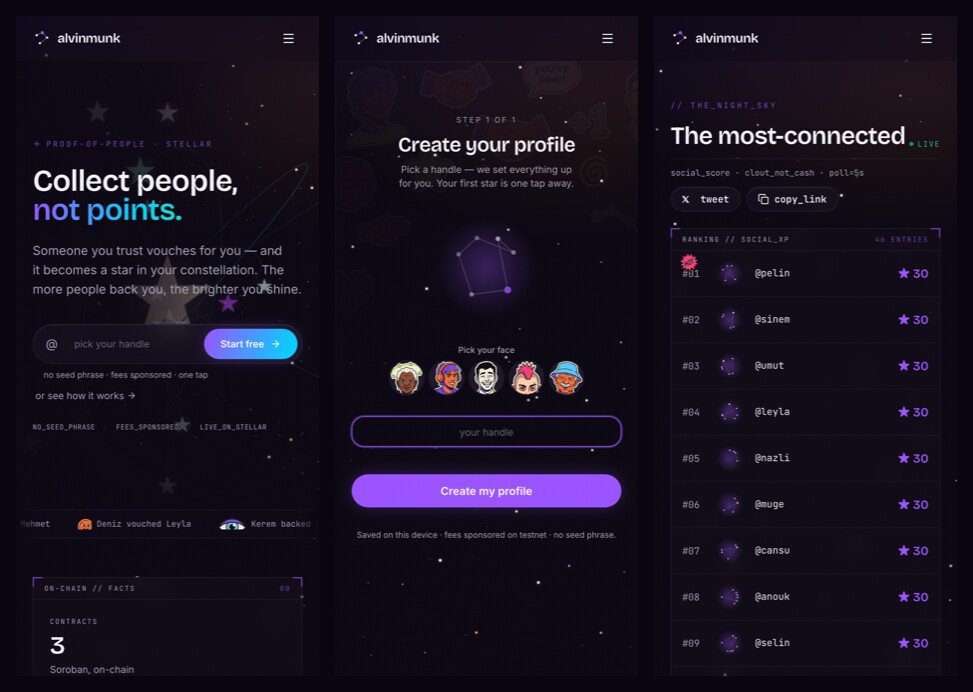
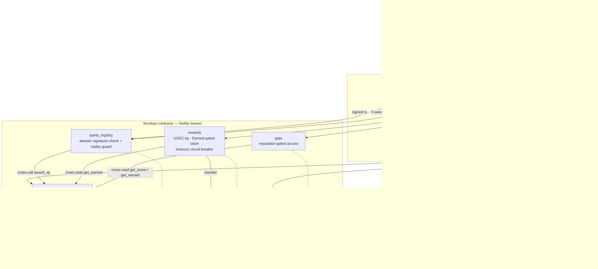

# 🛰️ alvinmunk

[](https://github.com/mericcintosun/alvinmunk/actions/workflows/ci.yml)
[](https://alvinmunk.vercel.app)
[](https://stellar.expert/explorer/testnet)

> **Collect people, not points.** A social, gamified, non-betting *proof-of-people* reputation game on Stellar/Soroban — built for the Rise In **Stellar Journey to Mastery** belt program (White → Master).

- You earn reputation through **mutual/social actions** (vouch for someone, complete a verifiable quest, tip), not solo grinding.
- Badges name **other humans** and auto-generate a shareable card — reputation about *others* is viral; reputation about *yourself* is a résumé.
- Reputation is **spendable**: it unlocks bounties, ranking, and USDC micro-rewards.



[](https://youtu.be/3FANRKLM6PI)

**▶ Live on Stellar testnet: [alvinmunk.vercel.app](https://alvinmunk.vercel.app)** · **▶ [Demo video (2 min)](https://youtu.be/3FANRKLM6PI)** · **[Live network stats](https://alvinmunk.vercel.app/stats)**

The full product thesis, the persona debates, and the belt-by-belt roadmap live in **[`belts/`](./belts/)** — start with **[`belts/00-strategy.md`](./belts/00-strategy.md)** (source of truth).

Belt-program evidence (White → Blue: screenshots, tx hashes, rubric tables) lives in **[docs/BELT_SUBMISSIONS.md](./docs/BELT_SUBMISSIONS.md)**.

## Contents

- [Quick start](#quick-start)
- [Architecture](#architecture-and-the-no-standing-backend-decision)
- [Deployed contracts (Stellar testnet)](#deployed-contracts-stellar-testnet)
- [The core loop](#the-core-loop-north-star)
- [What's a working skeleton vs. a TODO](#whats-a-working-skeleton-vs-a-todo)
- [Documentation](#documentation)
- [Contributing](#contributing)
- [Two-project rule](#two-project-rule)
- [License](#license)

---

## Quick start

### Prerequisites
- **Node ≥ 20** + **pnpm 9** (`corepack enable && corepack prepare pnpm@9 --activate`)
- **Rust stable** + `wasm32-unknown-unknown` target
- **Stellar CLI**: `cargo install --locked stellar-cli` (or `brew install stellar-cli`)

> ⚠️ **Pin versions before first build.** The dependency versions in `contracts/Cargo.toml` (`soroban-sdk`) and `apps/web/package.json` (`@stellar/stellar-sdk`, `passkey-kit` for passkey, `@stellar/freighter-api` + `@albedo-link/intent` for the `/wallet` connect modal) are best-effort and should be verified against the latest releases — these libraries move fast.

### 1. Install JS deps
```bash
pnpm install
```

### 2. Build + test everything
```bash
pnpm contracts:build      # stellar contract build (wasm32v1-none)
pnpm contracts:test       # cargo test — 6/6 reputation tests
pnpm typecheck && pnpm test   # web + shared: tsc + vitest (16 tests)
pnpm -C apps/web build    # next build
```

### 3. Run the app locally (no infra needed)
```bash
cp .env.example apps/web/.env.local   # optional; testnet defaults work as-is
pnpm dev                              # turbo -> next dev
```
**Onboarding works out-of-the-box on testnet** via a **dev wallet** (ephemeral keypair, Friendbot-funded) — Face ID / passkey kicks in once you set `NEXT_PUBLIC_PASSKEY_WALLET_WASM_HASH`, `PASSKEY_RELAYER_URL`, and `PASSKEY_RELAYER_API_KEY` (see [`docs/DEPLOY.md`](./docs/DEPLOY.md) §4 and [`docs/PASSKEY_HANDOFF.md`](./docs/PASSKEY_HANDOFF.md) for full setup). The dev wallet is hard-disabled on mainnet.

### 4. Deploy contracts to testnet
```bash
stellar keys generate --fund admin --network testnet
stellar keys generate --fund attester --network testnet
USDC_SAC=<your_usdc_sac_id> ADMIN=admin ATTESTER=attester ./scripts/deploy-testnet.sh
```
Copy the printed `NEXT_PUBLIC_*` ids into `apps/web/.env.local` (template: [`.env.example`](./.env.example)).

**Full “deploy your own” runbook** (keys → contracts → `.env.local` → web app → optional attester/faucet/passkey secrets): [`docs/DEPLOY.md`](./docs/DEPLOY.md).


---

## Architecture (and the "no standing backend" decision)

**[Jump to the diagram ↓](#system-diagram)** — five contracts, their cross-calls, the serverless attester, and the RPC-direct read path in one picture.

```
alvinmunk/                # project root (the repo)
├─ belts/                 # strategy + roadmaps (00-strategy + 08-anti-sybil are source of truth)
├─ docs/                  # every doc, indexed by audience in docs/README.md
├─ contracts/             # Soroban (Rust) workspace — 3 contracts
│  ├─ reputation/         #   Social vs Earned XP (two-track), async vouches, attestations
│  ├─ quest_registry/     #   allowlisted-attester verifiable quests + replay guard
│  └─ rewards/            #   USDC tip + Earned-gated payout (the spend sink)
├─ apps/web/              # Next.js 14 — frontend + serverless attester (API route)
│  ├─ src/lib/            #   wallet (passkey + dev fallback), stellar, genesis, profile
│  └─ src/app/api/attest/ #   the ONLY server-side piece (holds attester key)
├─ packages/shared/       # TS types, event schemas, schema ids, art engine, contract registry
├─ packages/sdk/          # @alvinmunk/sdk — publishable read-only client (reputation, handles, gates)
└─ scripts/               # deploy-testnet.sh (deploy + wire the 3 contracts)
```

**Backend?** No separate, always-on host. The only server-side need — the **attester signing key** — lives in a **Next.js serverless API route** (`/api/attest`), so it ships as one Vercel deploy. The MVP **leaderboard reads RPC `getEvents` directly**; a durable indexer is deferred until scale demands it (Blue/Black belt). See `belts/00-strategy.md`.

### On-chain design (why it's lean)
- **Two-track reputation (anti-sybil keystone, `belts/08-anti-sybil`):** **Social XP** (from vouches) is non-cashable — leaderboard/fun only; **Earned XP** (from attester-verified quests) is the *only* track `Rewards` reads to gate USDC. Vouches are `first-pair-only` (repeat pairs mint the card but grant 0 XP).
- **XP/badges = account-keyed contract storage**, non-transferable by the *absence* of a transfer fn (SBT semantics) — no per-badge NFT minting.
- **Oracle = allowlisted attesters with signed claims**, not a decentralized oracle.
- **Canonical `att_set` event emitted from day one** — append-only and retroactively impossible. This keeps the "reputation primitive" SCF door open for ~free; the `get_attestation`/`get_score`/`get_earned` read-views are pure adapters, never a second write path (`belts/00-strategy §4`).

### System diagram


```mermaid
flowchart TD
    subgraph Client["Browser"]
        User(["User"])
        Kit["Stellar Wallets Kit<br/>Freighter · xBull · Albedo · Rabet · LOBSTR · Hana<br/>+ passkey / dev wallet"]
    end

    subgraph Vercel["Single Vercel deploy — apps/web (Next.js 14)"]
        Web["Frontend<br/>leaderboard · /wallet · /u/handle · /stats"]
        Attester["/api/attest (serverless)<br/>the ONLY server-side piece — holds the attester key"]
    end

    subgraph Chain["Soroban contracts — Stellar testnet"]
        Reputation["reputation<br/>Social XP (vouch) · Earned XP (quest)<br/>att_set / get_score / get_earned"]
        QuestRegistry["quest_registry<br/>attester signature check + replay guard"]
        Rewards["rewards<br/>USDC tip · Earned-gated claim<br/>treasury circuit breaker"]
        Registry["registry<br/>handle ↔ address"]
        Gate["gate<br/>reputation-gated access"]
        USDC[("USDC (SAC)")]
    end

    RPC[("Soroban RPC<br/>getEvents")]

    User --> Kit --> Web

    Web -->|"signed tx"| Reputation
    Web -->|"signed tx"| QuestRegistry
    Web -->|"signed tx"| Rewards
    Web -->|"signed tx"| Registry
    Web -->|"signed tx"| Gate

    Web -->|"1 request quest proof"| Attester
    Attester -->|"2 signed attestation"| Web
    Web -->|"3 award_quest(sig)"| QuestRegistry
    QuestRegistry -->|"cross-call award_xp"| Reputation

    Rewards -->|"cross-read get_earned"| Reputation
    Rewards -->|"transfer"| USDC
    Gate -->|"cross-read get_score / get_earned"| Reputation

    Reputation -.->|"events"| RPC
    QuestRegistry -.->|"events"| RPC
    Rewards -.->|"events"| RPC
    Registry -.->|"events"| RPC
    Gate -.->|"events"| RPC

    RPC -->|"poll every 5s — no indexer, no standing backend"| Web
```

The frontend never talks to a database or a custom API server for reads — the leaderboard, activity feed, and `/stats` poll Soroban RPC's `getEvents` directly. The only write-side server code is `/api/attest`, which signs quest claims with the allowlisted attester key and ships as part of the same Vercel deploy (steps 1–3 above); everything else is a wallet-signed transaction straight to a contract.


---

## Deployed contracts (Stellar testnet)

Five Soroban contracts, deployed + cross-contract verified on-chain:

| Contract | Address |
| --- | --- |
| Reputation (Social/Earned XP, vouches, `att_set`) | [`CBP34OU4D2RN22PVGH5G5EN4HDWHAD5I7VCOLPPB4RD6NMKBJMXY6KT5`](https://stellar.expert/explorer/testnet/contract/CBP34OU4D2RN22PVGH5G5EN4HDWHAD5I7VCOLPPB4RD6NMKBJMXY6KT5) |
| Quest Registry (attester-signed quests) | [`CBEMRJPYICOVH2IGHXQDDDMQSXRR5YKJUD7QMDNI25PYZFPQNLTPH3PD`](https://stellar.expert/explorer/testnet/contract/CBEMRJPYICOVH2IGHXQDDDMQSXRR5YKJUD7QMDNI25PYZFPQNLTPH3PD) |
| Rewards (USDC tip + Earned-gated claim) | [`CA4XDPHJAUXYKQ6GGOBMB26N2JMIBPD4MB4CIANCPW53LGS2SVCR65CV`](https://stellar.expert/explorer/testnet/contract/CA4XDPHJAUXYKQ6GGOBMB26N2JMIBPD4MB4CIANCPW53LGS2SVCR65CV) |
| Registry (handle ↔ address) | [`CDRCCUTSOPGJJ5J7FLSW6PBB6R4SKS2F7YUU24GEKJGUEPA2LZH3A23F`](https://stellar.expert/explorer/testnet/contract/CDRCCUTSOPGJJ5J7FLSW6PBB6R4SKS2F7YUU24GEKJGUEPA2LZH3A23F) |
| Gate (reputation-gated access) | [`CCOKRQIUL4OY6PTWNAXPC7QKZMJMG2E73UMHGP357XRC6YKGOBUPSSMC`](https://stellar.expert/explorer/testnet/contract/CCOKRQIUL4OY6PTWNAXPC7QKZMJMG2E73UMHGP357XRC6YKGOBUPSSMC) |

The set was redeployed on 2026-09-30 to pick up the constructor, claim-key vouch and award-payload upgrades; the user-activity links in the [belt submissions](./docs/BELT_SUBMISSIONS.md) point at the previous deployment, where that activity happened. `deployments/testnet.json` always holds the current ids.
### Prerequisites
- **Node ≥ 24** + **pnpm 9** (`corepack enable && corepack prepare pnpm@9 --activate`)
- **Rust stable** + `wasm32-unknown-unknown` target
- **Stellar CLI**: `cargo install --locked stellar-cli` (or `brew install stellar-cli`)

---

## The core loop (north-star)

```
mint_vouch (async half-card)  →  share link = install funnel  →  claim_vouch (both earn XP)
        →  stake/quest  →  rank unlocks reward  →  tip / claim_reward in USDC
```

North-star metric: **Verified Value Loops / week** — a vouch staked & redeemed into USDC by a *different*, proof-of-funding-verified user, where the USDC was backed by real external value (`belts/08-anti-sybil`). Raw "closed loops" is a vanity sub-metric only.


---

## What's a working skeleton vs. a TODO

| Area | Status |
| --- | --- |
| `reputation` (two-track Social/Earned, async vouch mint/claim, first-pair guard, attester award, `att_set`, read views) | ✅ implemented + 6 unit tests |
| `quest_registry` (allowlist, replay guard, cross-call to reputation) | ✅ implemented |
| `rewards` (tip, Earned-gated claim, pause) | ✅ implemented |
| Monorepo / CI / deploy script / shared types + art engine | ✅ |
| **Sprint 1 / White belt**: wallet (passkey + dev fallback), onboarding, first on-chain tx (Genesis), Genesis Stamp art, profile | ✅ implemented + vitest |
| **Sprint 2 / Yellow belt**: `reputation` deployed to testnet; vouch mint/claim wired; leaderboard from `social` events (RPC-direct, 5s poll); event schema frozen | ✅ implemented + verified on-chain (social 10/10, earned 0/0) |
| Serverless attester `/api/attest` | 🟡 transport + structure done; **evidence verification stubbed** (Orange belt) |
| Passkey provider (`connectPasskey`) | 🟡 dev-wallet fallback works now; **wire passkey-kit** for FaceID (White belt infra) |
| Handle → address resolution | ✅ live in Tip (type `@handle`, registry resolves on-chain); vouch still address-based |
| Indexer | ⏸ deferred (RPC-direct for MVP) |

Each TODO references the belt doc that owns it. Build order follows the belts/sprints: see [`docs/SPRINTS.md`](./docs/SPRINTS.md). **Sprints 0–2 done; Orange + Green code complete** — all 3 contracts deployed + cross-contract verified on-chain, claim-secret vouch loop, real serverless attester (GitHub PR / referral tx), anti-sybil (claim-secret + per-day cap + asymmetric + first-pair + ring-flag), USDC tip rail + faucet, on-chain rank→reward table with treasury circuit breaker (daily cap + frozen set + proof-of-funding toggle), weekly streak, leaderboard snapshot cache. **134 tests green** (57 contract incl. property/fuzz + 59 web + 18 shared). Remaining for Orange/Green: public testers + 2-week live retention.


---

## Documentation

Every doc under [`docs/`](./docs/), grouped by audience — users, contributors, operators, product & design, and the program archive — is indexed in **[docs/README.md](./docs/README.md)**. Security policy and disclosure: [SECURITY.md](./SECURITY.md).

---

## Contributing

Built in the open. Bugs, contract work, tests, accessibility, docs and CI all come from people who
file an issue and open a PR — start at **[CONTRIBUTING.md](./CONTRIBUTING.md)** for the local
setup, the branch/commit conventions, and the full `pnpm check` gate list.

### Get paid to contribute: Drips Wave

This repo is an approved project in **[Drips Wave](https://www.drips.network/wave)**, the Stellar
Wave program. Every issue labelled **`Stellar Wave`** is a point-bountied unit of work in a
one-week sprint: fix it, merge it, and you earn Points — then withdraw your share of the Wave's
reward pool as USDC on Stellar.

| Step | What to do | Where |
| --- | --- | --- |
| **Find** | Browse the issues carrying the `Stellar Wave` label; scope labels like `good first issue`, `a11y`, `test` and `documentation` narrow the list | [Wave issues](https://github.com/mericcintosun/alvinmunk/labels/Stellar%20Wave) · [open only](https://github.com/mericcintosun/alvinmunk/issues?q=is%3Aissue+is%3Aopen+label%3A%22Stellar+Wave%22) |
| **Claim** | Complete your [Wave KYC](https://docs.drips.network/wave/contributors/solving-issues-and-earning-rewards) first, apply with how you'd approach it, and start coding once you are assigned — one active issue per person | the [Drips Wave app](https://www.drips.network/wave) and the issue thread |
| **PR** | Keep the diff to the issue, make `pnpm check` green, add tests, add before/after screenshots for UI work, and link the issue (`Closes #123`) | [CONTRIBUTING.md § Pull Request Process](./CONTRIBUTING.md#pull-request-process) |
| **Review** | Reviewed within the Wave window; wait 24–48 h before a polite follow-up | [CONTRIBUTING.md § Review](./CONTRIBUTING.md#4-review-what-to-expect) |
| **Points** | Trivial **100** · Medium **150** · High **200**, awarded when your merged PR resolves the issue; points are a *share* of the Wave pool, paid out in USDC | [Points & rewards](https://docs.drips.network/wave/points-and-rewards) |

The complete find → claim → PR → review → points flow, the quality bar (no bulk-generated
diffs, no duplicates) and the payout rules are in
**[CONTRIBUTING.md § Contributing through Drips Wave](./CONTRIBUTING.md#contributing-through-drips-wave)**.

### Contributors

Every merge is credited, and every merged PR is a public record of it — the live list is
**[all merged PRs by author](https://github.com/mericcintosun/alvinmunk/pulls?q=is%3Apr+is%3Amerged)**.
The Wave cohort that opened the backlog and got the first fifteen merged:

| Contributor | Merged contribution |
| --- | --- |
| [@Nife-tanny](https://github.com/Nife-tanny) | [#29](https://github.com/mericcintosun/alvinmunk/pull/29) — `decodeScVal` tests + malformed-input safety |
| [@dantebalor](https://github.com/dantebalor) | [#30](https://github.com/mericcintosun/alvinmunk/pull/30) — people-discovery page (handle search + vouch) |
| [@Mathew2k-hash](https://github.com/Mathew2k-hash) | [#31](https://github.com/mericcintosun/alvinmunk/pull/31) — EN/TR internationalisation + language switcher |
| [@wonderfulmarv01](https://github.com/wonderfulmarv01) | [#32](https://github.com/mericcintosun/alvinmunk/pull/32) — empty & loading states across the dashboard |
| [@estyemma](https://github.com/estyemma) | [#33](https://github.com/mericcintosun/alvinmunk/pull/33) — public reputation lookup page + read API |
| [@Sulex45](https://github.com/Sulex45) | [#34](https://github.com/mericcintosun/alvinmunk/pull/34) — `CONTRIBUTING.md` + issue/PR templates |
| [@Hayatt74](https://github.com/Hayatt74) | [#35](https://github.com/mericcintosun/alvinmunk/pull/35) — canonical on-chain event schema doc |
| [@opratem](https://github.com/opratem) | [#36](https://github.com/mericcintosun/alvinmunk/pull/36) — attester referral verification (+ tests) |
| [@Evaristus023](https://github.com/Evaristus023) | [#37](https://github.com/mericcintosun/alvinmunk/pull/37) — "deploy your own" testnet runbook |
| [@OkeQueen](https://github.com/OkeQueen) | [#38](https://github.com/mericcintosun/alvinmunk/pull/38) — architecture diagram in the README |
| [@maixuancanh](https://github.com/maixuancanh) | [#39](https://github.com/mericcintosun/alvinmunk/pull/39) — tests for the claim-secret hex helpers |
| [@N-otorious](https://github.com/N-otorious) | [#40](https://github.com/mericcintosun/alvinmunk/pull/40) — Web Push (VAPID) notify on vouch claim |
| [@shepherd-001](https://github.com/shepherd-001) | [#41](https://github.com/mericcintosun/alvinmunk/pull/41) — Playwright E2E smoke test in CI |
| [@MKNas01](https://github.com/MKNas01) | [#42](https://github.com/mericcintosun/alvinmunk/pull/42) — `get_profile` aggregate contract view + payments tests |
| [@ahnax](https://github.com/ahnax) | [#43](https://github.com/mericcintosun/alvinmunk/pull/43) — quest message-signing for Freighter & Albedo |

<details>
<summary>Contributors since the first Wave cohort</summary>

[@Agencybuilds](https://github.com/Agencybuilds) ·
[@kosisochukwu1234](https://github.com/kosisochukwu1234) ·
[@Opulencechuks](https://github.com/Opulencechuks) ·
[@Toyosi5566](https://github.com/Toyosi5566) ·
[@vincentokoye953-gif](https://github.com/vincentokoye953-gif) ·
[@CiiscoTech-Hub](https://github.com/CiiscoTech-Hub) ·
[@SrvFernandes](https://github.com/SrvFernandes) ·
[@maciejfolgmann](https://github.com/maciejfolgmann) ·
[@Abba073](https://github.com/Abba073) ·
[@chrissarah054-dotcom](https://github.com/chrissarah054-dotcom) ·
[@nlstylz](https://github.com/nlstylz) ·
[@esegbueadam-sys](https://github.com/esegbueadam-sys) ·
[@p70436464-prog](https://github.com/p70436464-prog) ·
[@blessingsokeke618-sys](https://github.com/blessingsokeke618-sys) ·
[@joshuaolabodebello2020-cyber](https://github.com/joshuaolabodebello2020-cyber) ·
[@akandeisaac021-design](https://github.com/akandeisaac021-design) ·
[@olubukolatanko209-doc](https://github.com/olubukolatanko209-doc) ·
[@xtep103](https://github.com/xtep103) ·
[@Hey-Yetunde](https://github.com/Hey-Yetunde) ·
[@Anadudev](https://github.com/Anadudev) ·
[@demola13777](https://github.com/demola13777) ·
[@maybay-dev](https://github.com/maybay-dev) ·
[@praise-idise](https://github.com/praise-idise) ·
[@Johnsource-hub](https://github.com/Johnsource-hub) ·
[@Manager-dev1515](https://github.com/Manager-dev1515) ·
[@Handynfts2](https://github.com/Handynfts2) ·
[@Niffy03](https://github.com/Niffy03) ·
[@Obito-2222](https://github.com/Obito-2222) ·
[@0xDamian-dev](https://github.com/0xDamian-dev) ·
[@olacodes-01](https://github.com/olacodes-01) ·
[@khalidNiass](https://github.com/khalidNiass) ·
[@TCreative001](https://github.com/TCreative001) ·
[@Chidi-Dev1](https://github.com/Chidi-Dev1) ·
[@otobongdev](https://github.com/otobongdev) ·
[@valentinachristopher911-design](https://github.com/valentinachristopher911-design) ·
[@AugistineCreates](https://github.com/AugistineCreates) ·
[@ugoocreates-pixel](https://github.com/ugoocreates-pixel) ·
[@devogechukwu](https://github.com/devogechukwu) ·
[@Olumide-01](https://github.com/Olumide-01) ·
[@Chummy-debug](https://github.com/Chummy-debug) ·
[@ekenealozie10-bit](https://github.com/ekenealozie10-bit) ·
[@vic2430](https://github.com/vic2430) ·
[@Chiwendu25](https://github.com/Chiwendu25) ·
[@mubby4](https://github.com/mubby4) ·
[@bernicechiagozie-collab](https://github.com/bernicechiagozie-collab) ·
[@emarkees](https://github.com/emarkees) ·
[@sammycee769](https://github.com/sammycee769) ·
[@omoniyiadebayo12goal-crypto](https://github.com/omoniyiadebayo12goal-crypto) ·
[@vally111](https://github.com/vally111) ·
[@bbstardts](https://github.com/bbstardts) ·
[@Binali223](https://github.com/Binali223) ·
[@Ipramking](https://github.com/Ipramking) ·
[@olaniyisamad65-cloud](https://github.com/olaniyisamad65-cloud) ·
[@Dfk234](https://github.com/Dfk234) ·
[@WHIZAB4TECH](https://github.com/WHIZAB4TECH) ·
[@TideX91](https://github.com/TideX91) ·
[@Nemenwq](https://github.com/Nemenwq) ·
[@V1ctor-o](https://github.com/V1ctor-o) ·
[@Ukorstack](https://github.com/Ukorstack) ·
[@desmond9p](https://github.com/desmond9p) ·
[@stan545](https://github.com/stan545) ·
[@rindicomfort](https://github.com/rindicomfort) ·
[@dayor2746-creator](https://github.com/dayor2746-creator) ·
[@Aycode01](https://github.com/Aycode01) ·
[@jast78](https://github.com/jast78) ·
[@olarh0170-netizen](https://github.com/olarh0170-netizen) ·
[@zainabwahab-eth](https://github.com/zainabwahab-eth) ·
[@notoflagosola-wq](https://github.com/notoflagosola-wq) ·
[@Atim-01](https://github.com/Atim-01) ·
[@victrexfx](https://github.com/victrexfx) ·
[@muokwejosh-cloud](https://github.com/muokwejosh-cloud) ·
[@Oluwasegun6921](https://github.com/Oluwasegun6921) ·
[@devpassionOX](https://github.com/devpassionOX) ·
[@Somtexzy](https://github.com/Somtexzy) ·
[@salienne](https://github.com/salienne) ·
[@isahpeter656-coder](https://github.com/isahpeter656-coder) ·
[@Nemenwa](https://github.com/Nemenwa) ·
[@fortunate61-lab](https://github.com/fortunate61-lab) ·
[@Princeadim](https://github.com/Princeadim) ·
[@0xNinx](https://github.com/0xNinx) ·
[@Hibhee01](https://github.com/Hibhee01) ·
[@Seermad1](https://github.com/Seermad1) ·
[@3nity610](https://github.com/3nity610) ·
[@Obaara293](https://github.com/Obaara293) ·
[@LayanGift](https://github.com/LayanGift) ·
[@Hamzasaheed](https://github.com/Hamzasaheed) ·
[@ritchiejhay](https://github.com/ritchiejhay) ·
[@alaminharuna-dev](https://github.com/alaminharuna-dev) ·
[@Walewavy](https://github.com/Walewavy) ·
[@drmfsltdoh](https://github.com/drmfsltdoh) ·
[@YoungBoss04](https://github.com/YoungBoss04) ·
[@Maxl500](https://github.com/Maxl500) ·
[@Dev-dave01](https://github.com/Dev-dave01) ·
[@DanProtocol](https://github.com/DanProtocol) ·
[@Agaki00](https://github.com/Agaki00) ·
[@Ezekiel146](https://github.com/Ezekiel146)

</details>

Not on the list yet? Claim a [`Stellar Wave`](https://github.com/mericcintosun/alvinmunk/labels/Stellar%20Wave)
issue and get it merged. Please don't edit this list in your PR (every Wave PR touching the same
lines would conflict); the maintainer refreshes it from the merged-PR history.


---

## Two-project rule

This repo (alvinmunk) is the **Builder-Track / $20k** play and the user's **primary** project. A separate idea targets the Startup Track / SCF. Rule (`00-strategy §7`): **alvinmunk ships a demonstrable belt-loop increment every week before any SCF hour.** Share infra so alvinmunk work feeds the SCF project.

## License
TBD.
