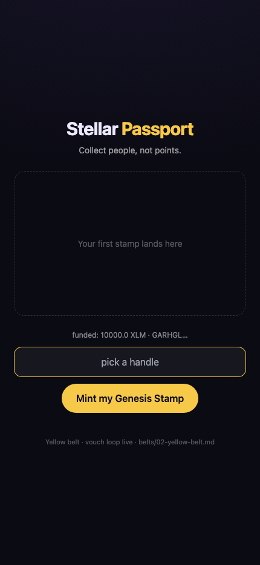
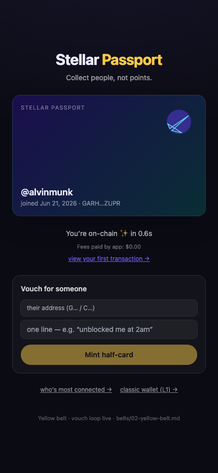
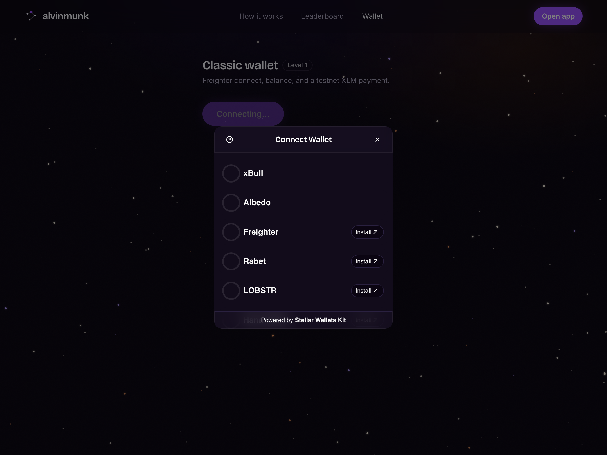
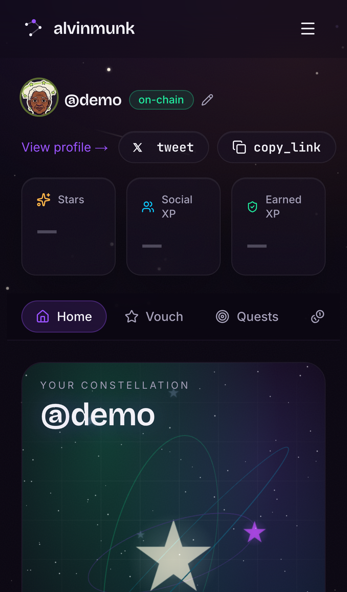
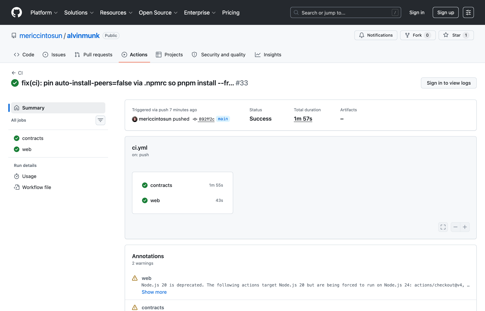
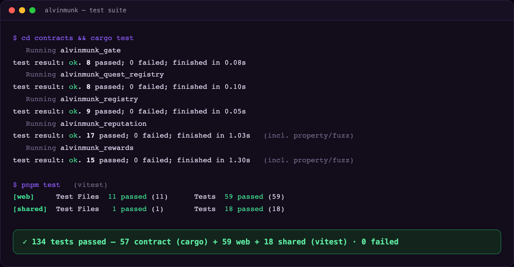

# Belt submissions — Rise In Stellar Journey to Mastery

The per-belt submission evidence for the Rise In **Stellar Journey to Mastery** program (White → Blue):
screenshots, transaction hashes and rubric tables, moved here unchanged from the [README](../README.md)
(only relative links were re-based; the live contract table stays in the README).

- [White Belt (Level 1)](#white-belt-level-1--submission-screenshots)
- [Yellow Belt (Level 2)](#yellow-belt-level-2--submission)
- [Orange Belt (Level 3)](#orange-belt-level-3--submission)
- [Green Belt (Level 4)](#green-belt-level-4--submission)
- [Blue Belt (Level 5)](#blue-belt-level-5--submission)

---

## White Belt (Level 1) — submission screenshots

Captured on **Stellar testnet** via the built-in wallet flow (passkey infra unset → a Friendbot-funded testnet keypair; a literal Freighter connect/disconnect + XLM-send flow is also shipped at the `/wallet` route).

| Wallet connected | Balance displayed | Successful testnet transaction |
| :---: | :---: | :---: |
|  |  |  |

The third shot shows the first on-chain transaction confirmed (`You're on-chain ✨ in 0.6s`) with a **view your first transaction →** link to Stellar Expert.

---

## Yellow Belt (Level 2) — submission

**Live demo:** https://alvinmunk.vercel.app · try the multi-wallet picker at [`/wallet`](https://alvinmunk.vercel.app/wallet).

Multi-wallet integration, a smart contract deployed to testnet + called from the frontend, live event handling, and visible transaction status.

### Wallet options available (Stellar Wallets Kit)

The `/wallet` route connects through the real **[Stellar Wallets Kit](https://github.com/Creit-Tech/Stellar-Wallets-Kit)** picker — Freighter, xBull, Albedo, Rabet, LOBSTR, and Hana behind one modal, normalized behind the app's `Wallet` interface (`apps/web/src/lib/wallet-kit.ts`).



### Deployed contracts (Stellar testnet)

The five contract ids, with explorer links, are in the [README table](../README.md#deployed-contracts-stellar-testnet).

The set was redeployed on 2026-09-30 to pick up the constructor, claim-key vouch and award-payload upgrades; the user-activity links further down point at the previous deployment, where that activity happened. `deployments/testnet.json` always holds the current ids.

### Contract call — transaction hash (verifiable on Stellar Expert)

A real `mint_vouch` call on the Reputation contract (reproduce with `node scripts/contract-call-hash.mjs`):

> **`aa69c8555db3027501f248a5d7a245bb3bf9b404a791e2b5053b31a2e6c2d178`**
> → https://stellar.expert/explorer/testnet/tx/aa69c8555db3027501f248a5d7a245bb3bf9b404a791e2b5053b31a2e6c2d178

### Requirements → where they live

| Requirement | Implementation |
| --- | --- |
| Multi-wallet integration | Stellar Wallets Kit picker — `apps/web/src/lib/wallet-kit.ts`, `apps/web/src/app/wallet/page.tsx` |
| 3+ error types (not-found / rejected / insufficient) | `wallet.ts` (Freighter not detected, access rejected), `utils.ts` `humanizeError` (insufficient balance / trustline / timeout) |
| Contract deployed on testnet | 5 contracts above (`scripts/deploy-testnet.sh`) |
| Contract called from the frontend | `lib/reputation.ts` `mint_vouch`/`claim_vouch`, `lib/rewards.ts` `tip`/`claim_reward`, via `lib/contracts.ts` `invokeAndWait` |
| Event listening + state sync | Leaderboard polls RPC `getEvents` every 5s (`lib/events.ts`, `app/leaderboard/page.tsx`); activity feed streams `vouch:claimed` events |
| Transaction status visible (pending/success/fail) | `app/wallet/page.tsx` status card + explorer link; contract calls poll to SUCCESS/FAILED with toasts |

---

## Orange Belt (Level 3) — submission

**Live demo:** https://alvinmunk.vercel.app

A complete end-to-end Stellar dApp: five Soroban contracts that talk to each other, live event streaming into the UI, a CI/CD pipeline that runs contract + frontend tests on every push, a mobile-responsive frontend, and error/loading states throughout.

### Screenshots

| Mobile responsive | CI/CD pipeline running | Test output (3+ passing) |
| :---: | :---: | :---: |
|  |  |  |

### Deployment & interaction (verifiable on-chain)

- **Contract addresses (testnet):** the five contracts in the [Yellow Belt table above](#deployed-contracts-stellar-testnet).
- **Transaction hash:** `mint_vouch` call → [`aa69c8555db3027501f248a5d7a245bb3bf9b404a791e2b5053b31a2e6c2d178`](https://stellar.expert/explorer/testnet/tx/aa69c8555db3027501f248a5d7a245bb3bf9b404a791e2b5053b31a2e6c2d178)

### Requirements → where they live

| Requirement | Implementation |
| --- | --- |
| Advanced smart contract development | 5 contracts: two-track reputation (async vouch mint/claim, first-pair guard, `att_set` versioning), signature-verified quest registry, USDC rewards with treasury circuit breaker, reputation gate, handle registry |
| **Inter-contract communication** | `gate.check`/`unlock` cross-reads `reputation.get_score`/`get_earned` (`gate/src/lib.rs:196`); `quest_registry.award_quest` cross-calls `reputation.award_xp` (`quest_registry/src/lib.rs:200`); `rewards` moves USDC via the SAC `token::Client` |
| **Event streaming & real-time updates** | Every contract publishes events (`social`, `xp`, `tipped`, `reward`, `unlocked`, `streak`, …); the leaderboard + activity feed poll RPC `getEvents` every 5s (`lib/events.ts`, `app/leaderboard/page.tsx`) |
| **CI/CD pipeline** | `.github/workflows/ci.yml` — contracts job (`cargo fmt --check`, `cargo clippy -D warnings`, `cargo test`) + web job (`pnpm typecheck`, `pnpm lint`, `pnpm test`) on every push/PR |
| Smart contract deployment workflow | `scripts/deploy-testnet.sh` (build → deploy with constructor arguments → cross-wire all 5 contracts); `contracts/Makefile` |
| Mobile responsive frontend | Tailwind responsive layout across all routes — see screenshot above |
| Error handling & loading states | `utils.ts` `humanizeError` (insufficient / trustline / timeout / rejected), toast + pending/success/fail status on every contract call |
| Writing tests for contracts and frontend | **134 tests green** — 57 contract (`cargo test`, incl. property/fuzz) + 59 web + 18 shared (`vitest`) |
| Production-ready architecture | pnpm/turbo monorepo, frozen-lockfile installs, shared types package, no standing backend (RPC-direct) — see [Architecture](../README.md#architecture-and-the-no-standing-backend-decision) |

### Reproduce the tests locally

```bash
cd contracts && cargo test      # 57 contract tests
pnpm test                       # 59 web + 18 shared tests (vitest)
```

**Demo video (1–2 min):** https://youtu.be/3FANRKLM6PI

---

## Green Belt (Level 4) — submission

**Live demo:** https://alvinmunk.vercel.app · **Live network stats:** https://alvinmunk.vercel.app/stats · **Demo video:** https://youtu.be/3FANRKLM6PI

A production MVP on Stellar with real users, one-tap onboarding, analytics + monitoring, and a live on-chain usage dashboard.

### Screenshots

| Product UI | Mobile responsive | Analytics / monitoring |
| :---: | :---: | :---: |
|  |  |  |

### Proof of 10+ user wallet interactions

- **50+ unique wallets** have interacted with the contracts (live count at [`/stats`](https://alvinmunk.vercel.app/stats), read straight from Soroban RPC — screenshot above). Each onboarded user signs on-chain: a genesis `manageData` tx + a `registry.claim` contract call; passkey users onboard as `C…` smart wallets, classic users as `G…`.
- **Verify on-chain:** every wallet + tx is on Stellar Expert. The registry contract shows all handle claims: [`CCT5EGFZ…`](https://stellar.expert/explorer/testnet/contract/CCT5EGFZ33IFLMUU6EBMC6NWRLX5TWJS5FICNJFBG7MU5PTAU6PFMVH4); the reputation contract shows vouch activity: [`CDRYXUS5…`](https://stellar.expert/explorer/testnet/contract/CDRYXUS55TKGYEM3YUB3YTJWQKSWWQABK6YPQK7SLEPVALWYK4IR7WCL).

### User feedback — collection, exported sheet & iteration

**Exported responses sheet (evidence):** [`docs/feedback/responses.xlsx`](./feedback/responses.xlsx) (Excel) · also [`docs/feedback/responses.csv`](./feedback/responses.csv). Collected via a public [Google Form](https://forms.gle/kNXR3zmZhGhgmrt58) (name/email, wallet or @handle, 1–5 rating, open feedback; [Notion mirror](https://star-eclipse-1fd.notion.site/395bfbe1987b475197474fcfba1e4464?pvs=105) also live) and exported via Responses → Google Sheets → Download `.xlsx`.

**Responses (raw evidence — the rows in the sheet above; handles are real on-chain users, `/u/<handle>`):**

| Name | Wallet or @handle | Rating | Notes / wants next |
| --- | --- | :---: | --- |
| Berkay Gündüz (beko) | [`GB72PZXN…YZ3H3`](https://stellar.expert/explorer/testnet/account/GB72PZXNOU6DJ2BXZDITS24A5JCN3CEUNTKIX5ESZDXAY2R5HO7YZ3H3) | 4/5 | "Interface is working well." → wants **weighted vouch** |
| Umut Akçayır | [@umut](https://alvinmunk.vercel.app/u/umut?network=testnet) | 5/5 | — |
| Leyla Bayıroğlu | [@leyla](https://alvinmunk.vercel.app/u/leyla?network=testnet) | 5/5 | — |
| Cansu Güzel | [@cansu](https://alvinmunk.vercel.app/u/cansu?network=testnet) | 3/5 | — |
| Nazlı Kır | [@nazli](https://alvinmunk.vercel.app/u/nazli?network=testnet) | 1/5 | — |

**Summary:** **5 responses, average 3.6/5**, ratings span 1–5 (organic, not all 5-star); UI praised; top qualitative request = **weighted vouch**.

**How we improve next, based on this feedback (with git commit link):**

| Feedback | Change shipped / planned | Commit |
| --- | --- | --- |
| "Recipients are hard — nobody memorizes a 56-char key" | **Tip by `@handle`** — registry resolves the handle to a wallet on-chain, with inline confirmation before sending (`components/Tip.tsx`) | [`2bac3c1`](https://github.com/mericcintosun/alvinmunk/commit/2bac3c1) |
| "weighted vouch" (top request) | Scoped weighted-vouch for the reputation track (weight by voucher reputation, split across vouchees, seed-set anchored) | planned — tracked in [`docs/USER_FEEDBACK.md`](./USER_FEEDBACK.md) |

### Requirements → where they live

| Requirement | Implementation |
| --- | --- |
| Production-ready MVP, mobile responsive, loading/error states | Next.js 14 on Vercel; `humanizeError` + skeletons + pending/success/fail toasts across every flow |
| Real-world onboarding | One-tap handle → passkey/dev wallet, fee-sponsored, no seed phrase (`components/landing-onboard.tsx`, `app/app`) |
| Monitoring + analytics | Vercel Analytics + Speed Insights (`components/analytics.tsx`) + live on-chain usage at `/stats` (`app/api/stats`) |
| 10+ users + wallet interactions | 50+ wallets on-chain (`/stats`), verifiable on Stellar Expert |
| Feedback collection + exported sheet | [Google Form](https://forms.gle/kNXR3zmZhGhgmrt58) → [`docs/feedback/responses.xlsx`](./feedback/responses.xlsx) (Excel) + raw-evidence table above |
| Contracts on testnet · 15+ commits · public repo · demo video | ✅ (see Yellow/Orange sections; 40+ commits) |

---

## Blue Belt (Level 5) — submission

Growth + a feedback loop that changed the product: a pitch deck, 50+ testnet users, real on-chain transaction activity, exported feedback, and a shipped improvement traceable to a specific request.

**Live app:** https://alvinmunk.vercel.app · **Live network stats:** https://alvinmunk.vercel.app/stats · **Demo video (full walkthrough):** https://youtu.be/3FANRKLM6PI

### Pitch deck

- **Designed deck (PDF):** [`docs/pitch-deck.pdf`](./pitch-deck.pdf) — 12 slides, brand-skinned (our violet/mint/gold palette, logo, and passport centerpiece), also viewable [on Canva](https://www.canva.com/d/JFRJdqiOBEvbz_4).
- **Outline / speaker notes:** [`docs/PITCH_DECK.md`](./PITCH_DECK.md) (problem → proof-of-people → two-track anti-sybil → traction → ask).

### Testnet users + real transaction activity

- **Live count at [`/stats`](https://alvinmunk.vercel.app/stats)** (Testnet tab), read straight from Soroban RPC `getEvents` — grows as people onboard, verifiable per-wallet on Stellar Expert.
- **Real activity, not just signups:** onboarding writes a genesis `manageData` tx + a `registry.claim` contract call; beyond that, wallets run `mint_vouch` / `claim_vouch` (Social XP) and attester-verified quests (Earned XP). The reputation contract [`CDRYXUS5…`](https://stellar.expert/explorer/testnet/contract/CDRYXUS55TKGYEM3YUB3YTJWQKSWWQABK6YPQK7SLEPVALWYK4IR7WCL) shows the vouch/claim traffic.

### Feedback → shipped improvement (with commit links)

Feedback is collected via the public [Google Form](https://forms.gle/kNXR3zmZhGhgmrt58) (name/email, wallet or @handle, 1–5 rating, open feedback; Notion mirror also live) and exported to an Excel sheet — [`docs/feedback/responses.xlsx`](./feedback/responses.xlsx) (also as [`.csv`](./feedback/responses.csv)) via Responses → Google Sheets → Download `.xlsx`.

| Feedback | Change shipped | Where |
| --- | --- | --- |
| Recipients are hard — nobody memorizes a 56-char key | **Tip by `@handle`**: type `@beko`, the registry resolves it to the wallet on-chain (debounced), with inline confirmation of the resolved address before sending | [`components/Tip.tsx`](../apps/web/src/components/Tip.tsx) |
| "weighted vouch" (top request) | Scoped for the reputation track — weight each vouch by the voucher's own reputation, split across their vouchees, anchored to a verified seed set | tracked in [`docs/USER_FEEDBACK.md`](./USER_FEEDBACK.md) |

### Requirements → where they live

| Requirement | Implementation |
| --- | --- |
| Pitch deck | [`docs/pitch-deck.pdf`](./pitch-deck.pdf) (brand-skinned) + [`docs/PITCH_DECK.md`](./PITCH_DECK.md) outline |
| 50+ testnet users | Live count at [`/stats`](https://alvinmunk.vercel.app/stats), verifiable on Stellar Expert |
| Real transaction activity | Vouch/claim/quest txs on-chain (reputation contract above) |
| Demo video (full walkthrough) | https://youtu.be/3FANRKLM6PI |
| Feedback collection + Excel export | [Google Form](https://forms.gle/kNXR3zmZhGhgmrt58) → [`docs/feedback/responses.xlsx`](./feedback/responses.xlsx) |
| Feedback-driven iteration (+ commit link) | Tip-by-`@handle` (`components/Tip.tsx`, [`2bac3c1`](https://github.com/mericcintosun/alvinmunk/commit/2bac3c1)) — see table above |

